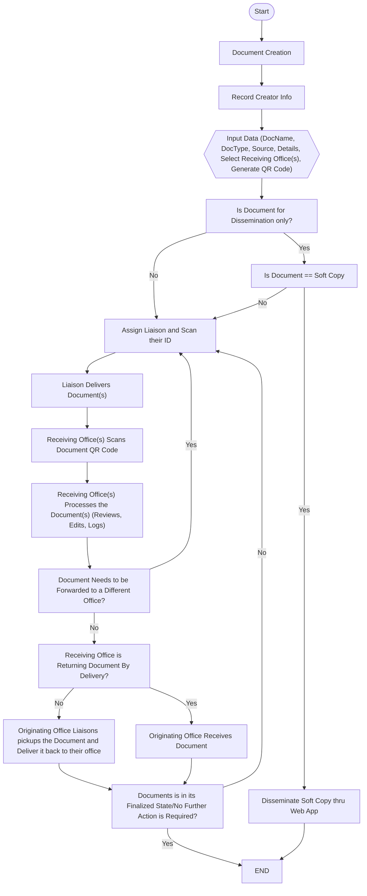
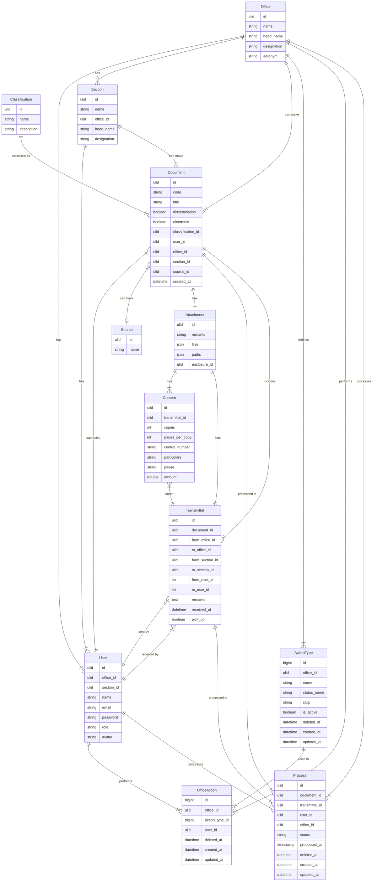

## Project Context
- This is a Document tracking system wherein we can track the incoming, outgoing documents and all the actions implemented on that document.

## Flowchart

```mermaid
flowchart TD
    n11(["Start"]) --> n15["Document Creation"]
    n15 --> n16["Record Creator Info"]
    n16 --> n17{{"Input Data (DocName, DocType, Source, Details, Select Receiving Office(s), Generate QR Code)"}}
    n17 --> n18["Is Document for Dissemination only?"]
    n18 -- No --> n20["Assign Liaison and Scan their ID"]
    n18 -- Yes --> n19["Is Document == Soft Copy"]
    n19 -- Yes --> n21["Disseminate Soft Copy thru Web App"]
    n19 -- No --> n20
    n20 --> n22["Liaison Delivers Document(s)"]
    n22 --> n23["Receiving Office(s) Scans Document QR Code"]
    n23 --> n24["Receiving Office(s) Processes the Document(s) (Reviews, Edits, Logs)"]
    n24 --> n25["Document Needs to be Forwarded to a Different Office?"]
    n25 -- Yes --> n20
    n25 -- No --> n26["Receiving Office is Returning Document By Delivery?"]
    n26 -- No --> n27["Originating Office Liaisons pickups the Document and Deliver it back to their office"]
    n27 --> F["Documents is in its Finalized State/No Further Action is Required?"]
    F -- Yes --> G["END"]
    F -- No --> n20
    n21 --> G
    n26 -- Yes --> n28["Originating Office Receives Document"]
    n28 --> F
```
## ER Diagram

```mermaid
erDiagram
Document {
  ulid id
  string code
  string title
  boolean dissemination
  boolean electronic
  ulid classification_id
  ulid user_id
  ulid office_id
  ulid section_id
  ulid source_id
  datetime created_at
}
Classification {
  ulid id
  string name
  string description
}
Office {
  ulid id
  string name
  string head_name
  string designation
  string acronym
}
Source {
  ulid id
  string name
}
Section {
  ulid id
  string name
  ulid office_id
  string head_name
  string designation
}
Transmittal {
  ulid id
  ulid document_id
  ulid from_office_id
  ulid to_office_id
  ulid from_section_id
  ulid to_section_id
  int from_user_id
  int to_user_id
  text remarks
  datetime received_at
  boolean pick_up
}
Content {
  ulid id
  ulid transmittal_id
  int copies
  int pages_per_copy
  string control_number
  string particulars
  string payee
  double amount
}
User {
  ulid id
  ulid office_id
  ulid section_id
  string name
  string email
  string password
  string role
  string avatar
}
Attachment {
  ulid id
  string remarks
  json files
  json paths
  ulid enclosure_id
}
ActionType {
    bigint id
    ulid office_id
    string name
    string status_name
    string slug
    boolean is_active
    datetime deleted_at
    datetime created_at
    datetime updated_at
}
OfficeAction {
    bigint id
    ulid office_id
    bigint action_type_id
    ulid user_id
    datetime deleted_at
    datetime created_at
    datetime updated_at
}
Process {
    ulid id
    ulid document_id
    ulid transmittal_id
    ulid user_id
    ulid office_id
    string status
    timestamp processed_at
    datetime deleted_at
    datetime created_at
    datetime updated_at
}

Transmittal }|--|| Document : "includes"
Section || -- |{ User : "has"
Office || -- |{ User : "has"
Content }|--|| Transmittal : "under"
Transmittal }|--|| User : "sent by"
Transmittal }|--|| User : "received by"
Office ||--o{ Section : "has"
Document }| -- || User : "can make"
Office || -- |{ Document : "can make"
Section || -- |{ Document : "can make"
Classification ||--|{ Document : "classified as"
Document }| -- o| Source : "can have"
Document ||--|| Attachment : "has"
Transmittal ||--|| Attachment : "has"
Attachment ||--|{ Content : "has"
Office ||--|{ ActionType : "defines"
ActionType ||--|{ OfficeAction : "used in"
Office ||--|{ OfficeAction : "performs"
User ||--|{ OfficeAction : "performs"
Document ||--|{ Process : "processed in"
Transmittal ||--|{ Process : "processed in"
User ||--|{ Process : "processes"
Office ||--|{ Process : "processes"
```