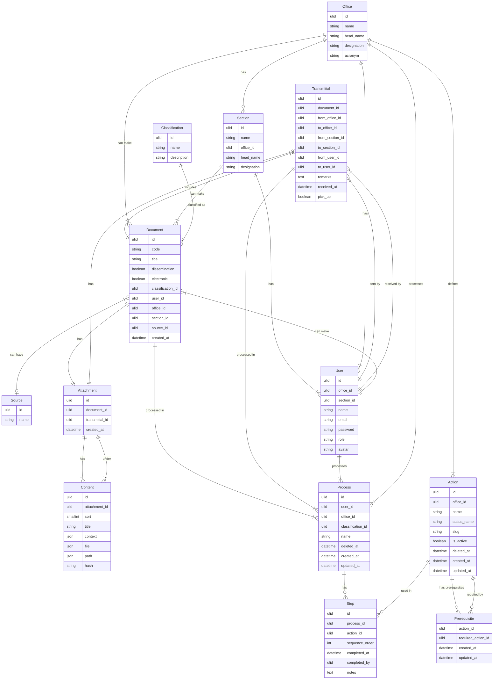

# Envoyr Document Tracking System - Database Schema Documentation

## Overview

The Envoyr database schema is designed to support a comprehensive government document tracking system with sophisticated workflow management, multi-office transmission capabilities, and complete audit trail functionality. The schema uses **ULIDs (Universally Unique Lexicographically Sortable Identifiers)** as primary keys for distributed system support and improved performance.

## Architecture Principles

- **ULID-Based Primary Keys**: Better distributed system support, lexicographically sortable
- **Soft Deletes**: Complete audit trails with logical deletion (`deleted_at` timestamps)
- **Automatic Timestamps**: All tables include `created_at` and `updated_at` columns
- **Foreign Key Constraints**: Comprehensive referential integrity enforcement
- **Strategic Indexing**: Performance-optimized indexes for common query patterns
- **JSON Storage**: Flexible metadata storage using JSONB columns

---

## System Flowchart


---

## Entity-Relationship Diagram



---

## Core Tables

### 1. users

**Purpose**: User authentication, authorization, and profile management with invitation workflow.

**Table Structure**:
```sql
CREATE TABLE users (
    id ULID PRIMARY KEY,
    name VARCHAR(255) NULL,
    email VARCHAR(255) UNIQUE NOT NULL,
    password VARCHAR(255) NULL,
    avatar VARCHAR(255) NULL,
    role VARCHAR(255) DEFAULT 'user',
    office_id ULID NOT NULL,
    section_id ULID NULL,
    designation VARCHAR(255) NULL,
    
    -- Invitation workflow
    invitation_token VARCHAR(255) UNIQUE NULL,
    invitation_expires_at TIMESTAMP NULL,
    invitation_accepted_at TIMESTAMP NULL,
    invited_by ULID NULL,
    
    -- Deactivation tracking
    deactivated_at TIMESTAMP NULL,
    deactivated_by ULID NULL,
    
    -- Laravel defaults
    remember_token VARCHAR(100) NULL,
    email_verified_at TIMESTAMP NULL,
    deleted_at TIMESTAMP NULL,
    created_at TIMESTAMP NOT NULL,
    updated_at TIMESTAMP NOT NULL,
    
    FOREIGN KEY (office_id) REFERENCES offices(id) ON DELETE CASCADE,
    FOREIGN KEY (section_id) REFERENCES sections(id) ON DELETE CASCADE,
    FOREIGN KEY (invited_by) REFERENCES users(id) ON DELETE SET NULL,
    FOREIGN KEY (deactivated_by) REFERENCES users(id) ON DELETE SET NULL
);
```

**Business Rules**:
- Self-referencing foreign keys for invitation and deactivation tracking
- Nullable password for users pending invitation acceptance
- Role-based access control using enum values
- Soft deletes enabled for audit trail preservation

**Related Tables**: `offices`, `sections`, `documents`, `transmittals`, `processes`

---

### 2. offices

**Purpose**: Organizational units representing departments or divisions.

**Table Structure**:
```sql
CREATE TABLE offices (
    id ULID PRIMARY KEY,
    acronym VARCHAR(255) NOT NULL,
    name VARCHAR(255) NOT NULL,
    head_name VARCHAR(255) NULL,
    designation VARCHAR(255) NULL,
    created_at TIMESTAMP NOT NULL,
    updated_at TIMESTAMP NOT NULL,
    deleted_at TIMESTAMP NULL
);
```

**Business Rules**:
- Each office can have multiple sections
- Office head information stored as denormalized data for performance
- Soft deletes enabled
- Cascading deletes propagate to users, documents, and sections

**Related Tables**: `sections`, `users`, `documents`, `transmittals`, `actions`, `processes`

---

### 3. sections

**Purpose**: Sub-divisions within offices for organizational granularity.

**Table Structure**:
```sql
CREATE TABLE sections (
    id ULID PRIMARY KEY,
    name VARCHAR(255) NOT NULL,
    office_id ULID NOT NULL,
    user_id ULID NULL,  -- Section head
    head_name VARCHAR(255) NULL,
    designation VARCHAR(255) NULL,
    created_at TIMESTAMP NOT NULL,
    updated_at TIMESTAMP NOT NULL,
    deleted_at TIMESTAMP NULL,
    
    FOREIGN KEY (office_id) REFERENCES offices(id) ON DELETE CASCADE ON UPDATE CASCADE,
    FOREIGN KEY (user_id) REFERENCES users(id) ON DELETE SET NULL ON UPDATE CASCADE
);
```

**Business Rules**:
- Must belong to an office
- Optional section head (user_id)
- Denormalized head_name and designation for performance
- Circular reference with users table (resolved through migration ordering)

**Related Tables**: `offices`, `users`, `documents`, `transmittals`

---

### 4. classifications

**Purpose**: Document categorization (memos, letters, reports, etc.).

**Table Structure**:
```sql
CREATE TABLE classifications (
    id ULID PRIMARY KEY,
    name VARCHAR(255) NOT NULL,
    description TEXT NULL,
    created_at TIMESTAMP NOT NULL,
    updated_at TIMESTAMP NOT NULL
);
```

**Business Rules**:
- Simple lookup table for document types
- No soft deletes (cascading deletes to documents)

**Related Tables**: `documents`, `processes`, `statuses`

---

### 5. sources

**Purpose**: Track document origin (internal/external sources).

**Table Structure**:
```sql
CREATE TABLE sources (
    id ULID PRIMARY KEY,
    name VARCHAR(255) NOT NULL,
    description VARCHAR(255) NULL,
    created_at TIMESTAMP NOT NULL,
    updated_at TIMESTAMP NOT NULL
);
```

**Business Rules**:
- Optional relationship with documents
- Examples: External Agency, Internal Memo, Public Request

**Related Tables**: `documents`

---

### 6. documents

**Purpose**: Core document entity with metadata and tracking information.

**Table Structure**:
```sql
CREATE TABLE documents (
    id ULID PRIMARY KEY,
    code VARCHAR(255) UNIQUE NOT NULL,
    title VARCHAR(255) NOT NULL,
    electronic BOOLEAN DEFAULT false,
    dissemination BOOLEAN DEFAULT false,
    classification_id ULID NOT NULL,
    user_id ULID NOT NULL,  -- Creator
    office_id ULID NOT NULL,  -- Originating office
    section_id ULID NOT NULL,  -- Originating section
    source_id ULID NULL,
    published_at TIMESTAMP NULL,
    deleted_at TIMESTAMP NULL,
    created_at TIMESTAMP NOT NULL,
    updated_at TIMESTAMP NOT NULL,
    
    FOREIGN KEY (classification_id) REFERENCES classifications(id) ON DELETE CASCADE,
    FOREIGN KEY (user_id) REFERENCES users(id) ON DELETE CASCADE,
    FOREIGN KEY (office_id) REFERENCES offices(id) ON DELETE CASCADE,
    FOREIGN KEY (section_id) REFERENCES sections(id) ON DELETE CASCADE,
    FOREIGN KEY (source_id) REFERENCES sources(id) ON DELETE SET NULL,
    
    INDEX idx_office_created (office_id, created_at),
    INDEX idx_office_deleted (office_id, deleted_at),
    INDEX idx_created_at (created_at),
    INDEX idx_published_at (published_at)
);
```

**Business Rules**:
- Unique auto-generated code (pattern: `??????####` - 6 letters + 4 digits)
- Electronic flag: true for digital documents, false for physical
- Dissemination flag: true for mass distribution documents
- Published_at: NULL = draft, NOT NULL = published
- Soft deletes enabled for complete audit trail

**Indexes**:
- `idx_office_created`: Common query pattern (documents by office and date)
- `idx_office_deleted`: Soft delete queries per office
- `idx_created_at`: Chronological sorting
- `idx_published_at`: Filter published/draft documents

**Related Tables**: `users`, `offices`, `sections`, `classifications`, `sources`, `transmittals`, `attachments`, `labels`, `processes`

---

### 7. transmittals

**Purpose**: Document transmission records between offices with routing information.

**Table Structure**:
```sql
CREATE TABLE transmittals (
    id ULID PRIMARY KEY,
    code VARCHAR(255) UNIQUE NOT NULL,
    purpose VARCHAR(255) NOT NULL,
    remarks TEXT NULL,
    pick_up BOOLEAN DEFAULT false,
    document_id ULID NOT NULL,
    from_office_id ULID NOT NULL,
    from_section_id ULID NULL,
    from_user_id ULID NULL,
    to_office_id ULID NOT NULL,
    to_section_id ULID NULL,
    to_user_id ULID NULL,
    liaison_id ULID NULL,  -- Document courier
    received_at TIMESTAMP NULL,
    created_at TIMESTAMP NOT NULL,
    updated_at TIMESTAMP NOT NULL,
    
    FOREIGN KEY (document_id) REFERENCES documents(id) ON DELETE CASCADE,
    FOREIGN KEY (from_office_id) REFERENCES offices(id) ON DELETE CASCADE,
    FOREIGN KEY (from_section_id) REFERENCES sections(id) ON DELETE CASCADE,
    FOREIGN KEY (from_user_id) REFERENCES users(id) ON DELETE CASCADE,
    FOREIGN KEY (to_office_id) REFERENCES offices(id) ON DELETE CASCADE,
    FOREIGN KEY (to_section_id) REFERENCES sections(id) ON DELETE CASCADE,
    FOREIGN KEY (to_user_id) REFERENCES users(id) ON DELETE CASCADE,
    FOREIGN KEY (liaison_id) REFERENCES users(id) ON DELETE CASCADE,
    
    INDEX idx_to_office_received (to_office_id, received_at),
    INDEX idx_document_received (document_id, received_at),
    INDEX idx_from_office_created (from_office_id, created_at)
);
```

**Business Rules**:
- Unique auto-generated code (pattern: `??????????` - 10 letters)
- Active transmittal: `received_at IS NULL`
- Only one active transmittal per document at any time
- Pick_up flag: true = pickup, false = delivery
- Liaison tracks document courier
- received_at tracks when destination office received the document

**Indexes**:
- `idx_to_office_received`: Incoming documents per office
- `idx_document_received`: Document transmission history
- `idx_from_office_created`: Outgoing documents per office

**Related Tables**: `documents`, `offices`, `sections`, `users`, `attachments`, `processes`

---

### 8. attachments

**Purpose**: File associations for documents and transmittals (supports versioning).

**Table Structure**:
```sql
CREATE TABLE attachments (
    id ULID PRIMARY KEY,
    document_id ULID NOT NULL,
    transmittal_id ULID NULL,  -- NULL = draft, NOT NULL = snapshot
    created_at TIMESTAMP NOT NULL,
    updated_at TIMESTAMP NOT NULL,
    
    FOREIGN KEY (document_id) REFERENCES documents(id) ON DELETE CASCADE,
    FOREIGN KEY (transmittal_id) REFERENCES transmittals(id) ON DELETE CASCADE
);
```

**Business Rules**:
- Draft attachments: `transmittal_id IS NULL`
- Transmittal snapshots: `transmittal_id IS NOT NULL` (point-in-time file copies)
- Enables file version control per transmission
- Cascade deletion removes associated content files

**Related Tables**: `documents`, `transmittals`, `contents`

---

### 9. contents

**Purpose**: File metadata and storage information with integrity verification.

**Table Structure**:
```sql
CREATE TABLE contents (
    id ULID PRIMARY KEY,
    sort SMALLINT DEFAULT 0,
    title VARCHAR(255) NOT NULL,
    context JSONB NULL,  -- Additional metadata
    file JSONB NULL,  -- File information
    path JSONB NULL,  -- Storage paths
    hash VARCHAR(64) NULL,  -- SHA-256 file hash
    attachment_id ULID NOT NULL,
    created_at TIMESTAMP NOT NULL,
    updated_at TIMESTAMP NOT NULL,
    
    FOREIGN KEY (attachment_id) REFERENCES attachments(id) ON DELETE CASCADE,
    INDEX idx_title (title)
);
```

**Business Rules**:
- Sort field for file ordering within attachment
- Hash field for file integrity verification (SHA-256)
- JSONB columns for flexible metadata storage
- Electronic content detection: `hash IS NOT NULL`

**Related Tables**: `attachments`

---

### 10. processes

**Purpose**: Workflow instances for document processing within offices.

**Table Structure**:
```sql
CREATE TABLE processes (
    id ULID PRIMARY KEY,
    user_id ULID NOT NULL,
    office_id ULID NULL,
    classification_id ULID NULL,
    name VARCHAR(255) NULL,
    deleted_at TIMESTAMP NULL,
    created_at TIMESTAMP NOT NULL,
    updated_at TIMESTAMP NOT NULL,
    
    FOREIGN KEY (user_id) REFERENCES users(id) ON DELETE CASCADE,
    FOREIGN KEY (office_id) REFERENCES offices(id) ON DELETE CASCADE,
    FOREIGN KEY (classification_id) REFERENCES classifications(id) ON DELETE CASCADE
);
```

**Business Rules**:
- Auto-inherits classification from document
- User_id tracks process owner
- Soft deletes enabled
- Links to documents through steps or separate relationship

**Related Tables**: `users`, `offices`, `classifications`, `actions` (via `steps`)

---

### 11. actions

**Purpose**: Office-specific action definitions representing workflow steps that can be performed on documents.

**Table Structure**:
```sql
CREATE TABLE actions (
    id ULID PRIMARY KEY,
    office_id ULID NOT NULL,
    name VARCHAR(255) NOT NULL,
    status_name VARCHAR(255) NOT NULL,
    slug VARCHAR(255) UNIQUE NOT NULL,
    description TEXT NULL,
    is_active BOOLEAN DEFAULT true,
    deleted_at TIMESTAMP NULL,
    created_at TIMESTAMP NOT NULL,
    updated_at TIMESTAMP NOT NULL,
    
    FOREIGN KEY (office_id) REFERENCES offices(id) ON DELETE CASCADE,
    UNIQUE KEY unique_office_slug (office_id, slug),
    INDEX idx_office_active (office_id, is_active)
);
```

**Business Rules**:
- Each office defines their own actions (direct one-to-many relationship)
- Slug auto-generated from name using `Str::slug()` (URL-friendly)
- is_active enables/disables actions without deleting them
- status_name: human-readable status displayed when action is active
- Soft deletes enabled for complete audit trail
- Self-referencing prerequisites managed through `prerequisites` pivot table

**Automatic Slug Generation**:
```php
// Action Model - Observer pattern
protected static function boot() {
    parent::boot();
    
    static::creating(function ($action) {
        if ($action->name) {
            $action->slug = Str::slug($action->name);
        }
    });
    
    static::updating(function ($action) {
        if ($action->isDirty('name') && $action->name) {
            $action->slug = Str::slug($action->name);
        }
    });
}
```

**Related Tables**: `offices`, `processes` (via `steps`), self-referencing (via `prerequisites`)

---

### 12. prerequisites

**Purpose**: Self-referencing many-to-many pivot table defining prerequisite relationships between actions.

**Table Structure**:
```sql
CREATE TABLE prerequisites (
    id ULID PRIMARY KEY,
    action_id ULID NOT NULL,           -- Action that has the prerequisite
    required_action_id ULID NOT NULL,  -- Action that must be completed first
    created_at TIMESTAMP NOT NULL,
    updated_at TIMESTAMP NOT NULL,
    
    FOREIGN KEY (action_id) REFERENCES actions(id) ON DELETE CASCADE,
    FOREIGN KEY (required_action_id) REFERENCES actions(id) ON DELETE CASCADE,
    UNIQUE KEY unique_prerequisite (action_id, required_action_id),
    INDEX idx_action (action_id),
    INDEX idx_required (required_action_id)
);
```

**Business Rules**:
- Defines complex prerequisite chains for workflow dependencies
- Prevents duplicate prerequisites via unique constraint
- Enables topological sorting (Kahn's algorithm + DFS) for workflow ordering
- Circular dependency detection required at application level
- Self-referencing: both foreign keys point to `actions` table

**Conceptual Model**:
```
Action A requires Action B  →  row: (action_id: A, required_action_id: B)
Meaning: Action A cannot execute until Action B is completed
```

**Eloquent Relationships**:
```php
// In Action model
public function prerequisites(): BelongsToMany {
    return $this->belongsToMany(
        Action::class,
        'prerequisites',
        'action_id',
        'required_action_id'
    )->withTimestamps();
}

public function dependents(): BelongsToMany {
    return $this->belongsToMany(
        Action::class,
        'prerequisites',
        'required_action_id',
        'action_id'
    )->withTimestamps();
}
```

**Related Tables**: `actions` (self-referencing)

---

### 13. steps

**Purpose**: Pivot table representing sequential workflow steps within a process, linking processes to actions with completion tracking and ordering.

**Table Structure**:
```sql
CREATE TABLE steps (
    id ULID PRIMARY KEY,
    process_id ULID NOT NULL,
    action_id ULID NOT NULL,
    sequence_order INT DEFAULT 1,
    completed_at DATETIME NULL,
    completed_by ULID NULL,
    notes TEXT NULL,
    created_at TIMESTAMP NOT NULL,
    updated_at TIMESTAMP NOT NULL,
    
    FOREIGN KEY (process_id) REFERENCES processes(id) ON DELETE CASCADE,
    FOREIGN KEY (action_id) REFERENCES actions(id) ON DELETE CASCADE,
    FOREIGN KEY (completed_by) REFERENCES users(id) ON DELETE SET NULL,
    UNIQUE KEY unique_step (process_id, action_id),
    INDEX idx_process_sequence (process_id, sequence_order),
    INDEX idx_action_completion (action_id, completed_at)
);
```

**Business Rules**:
- sequence_order: determines step execution order (topologically sorted based on action prerequisites)
- completed_at: NULL = pending step, NOT NULL = completed step
- completed_by: tracks which user completed the step
- notes: optional completion notes or comments
- Unique constraint prevents duplicate action assignments to same process
- Sequence order automatically assigned during process creation based on topological sort

**Conceptual Model**:
```
Process has many Steps (sequential workflow execution)
  Each Step represents:
    - An Action being executed in a Process
    - Its position in the workflow (sequence_order)
    - Completion status and metadata
```

**Eloquent Relationships**:
```php
// In Process model
public function actions(): BelongsToMany {
    return $this->belongsToMany(Action::class, 'steps')
        ->withPivot('sequence_order', 'completed_at', 'completed_by', 'notes')
        ->withTimestamps()
        ->orderBy('sequence_order');
}

// In Action model
public function processes(): BelongsToMany {
    return $this->belongsToMany(Process::class, 'steps')
        ->withPivot('sequence_order', 'completed_at', 'completed_by', 'notes')
        ->withTimestamps();
}
```

**Related Tables**: `processes`, `actions`, `users`

---

### 14. tags

**Purpose**: Tag taxonomy for document categorization.

**Table Structure**:
```sql
CREATE TABLE tags (
    id ULID PRIMARY KEY,
    name VARCHAR(255) NOT NULL,
    created_at TIMESTAMP NOT NULL,
    updated_at TIMESTAMP NOT NULL
);
```

**Business Rules**:
- Simple tag entity for flexible categorization
- No soft deletes

**Related Tables**: `labels` (pivot)

---

### 15. labels

**Purpose**: Many-to-many pivot between documents and tags.

**Table Structure**:
```sql
CREATE TABLE labels (
    id ULID PRIMARY KEY,
    document_id ULID NOT NULL,
    tag_id ULID NOT NULL,
    created_at TIMESTAMP NOT NULL,
    updated_at TIMESTAMP NOT NULL,
    
    FOREIGN KEY (document_id) REFERENCES documents(id) ON DELETE CASCADE,
    FOREIGN KEY (tag_id) REFERENCES tags(id) ON DELETE CASCADE
);
```

**Business Rules**:
- Links documents to tags
- Cascade deletion when document or tag is deleted

**Related Tables**: `documents`, `tags`

---

### 16. statuses

**Purpose**: Office-specific status definitions per classification.

**Table Structure**:
```sql
CREATE TABLE statuses (
    id ULID PRIMARY KEY,
    title TEXT NOT NULL,
    classification_id ULID NOT NULL,
    office_id ULID NOT NULL,
    created_at TIMESTAMP NOT NULL,
    updated_at TIMESTAMP NOT NULL,
    
    FOREIGN KEY (classification_id) REFERENCES classifications(id) ON DELETE CASCADE,
    FOREIGN KEY (office_id) REFERENCES offices(id) ON DELETE CASCADE
);
```

**Business Rules**:
- Custom statuses per office and classification combination
- Enables office-specific workflow states

**Related Tables**: `classifications`, `offices`

---

## Relationship Summary

### One-to-Many Relationships

1. **Office → Sections**: One office has many sections
2. **Office → Users**: One office has many users
3. **Office → Documents**: One office creates many documents
4. **Office → Actions**: One office defines many actions (workflow steps)
5. **Office → Processes**: One office has many processes
6. **Section → Users**: One section has many users
7. **Section → Documents**: One section creates many documents
8. **User → Documents**: One user creates many documents
9. **User → Transmittals (from)**: One user sends many transmittals
10. **User → Transmittals (to)**: One user receives many transmittals
11. **User → Processes**: One user owns many processes
12. **Classification → Documents**: One classification has many documents
13. **Classification → Processes**: One classification has many processes
14. **Source → Documents**: One source has many documents
15. **Document → Transmittals**: One document has many transmittals
16. **Document → Attachments**: One document has many attachments
17. **Transmittal → Attachments**: One transmittal has many attachments (snapshots)
18. **Attachment → Contents**: One attachment has many content files

### Many-to-Many Relationships

1. **Documents ↔ Tags** (via `labels`): Documents can have many tags
2. **Processes ↔ Actions** (via `steps`): Processes have many actions as sequential workflow steps with ordering and completion tracking
3. **Actions ↔ Actions** (via `prerequisites`): Self-referencing prerequisite/dependency relationships

### Self-Referencing Relationships

1. **Users → Users (invited_by)**: User invitation tracking
2. **Users → Users (deactivated_by)**: User deactivation tracking
3. **Actions → Actions (prerequisites)**: Self-referencing prerequisite dependencies via `prerequisites` pivot table
   - `prerequisites()`: Actions that must be completed before this action
   - `dependents()`: Actions that require this action to be completed first

### Cascade Behaviors

- **ON DELETE CASCADE**: Most foreign keys propagate deletions
- **ON DELETE SET NULL**: Optional relationships (sources, section heads, invitation tracking)
- **ON UPDATE CASCADE**: Sections maintain referential integrity on updates

---

## Schema Business Rules

### 1. ULID Architecture

**Why ULIDs instead of auto-increment integers?**

- **Distributed System Support**: ULIDs can be generated client-side without database coordination
- **Sortability**: Lexicographically sortable by creation time
- **Security**: Non-sequential IDs prevent enumeration attacks
- **Performance**: 128-bit ULIDs vs 64-bit bigints; better for distributed databases
- **URL-Friendly**: Base32-encoded, URL-safe strings

**No Exceptions**: All business entity tables use ULID primary keys for consistency and distributed system support.

### 2. Soft Delete Strategy

**Tables with Soft Deletes**:
- users
- offices
- sections
- documents
- processes
- actions

**Purpose**:
- Complete audit trail preservation
- Data recovery capability
- Regulatory compliance
- Historical reporting

**Implementation**:
- `deleted_at TIMESTAMP NULL`
- Laravel's `SoftDeletes` trait
- Queries automatically exclude soft-deleted records

### 3. Automatic Code Generation

**Documents**:
- Pattern: `??????####` (6 random letters + 4 random digits)
- Example: `ABCDEF1234`
- Generated during model creation with collision detection

**Transmittals**:
- Pattern: `??????????` (10 random letters)
- Example: `ABCDEFGHIJ`
- Unique transmission identifiers

**Business Logic**:
```php
// Generate 10 candidates, check for conflicts, assign first available
do {
    $codes = collect(range(1, 10))->map(fn() => $faker->bothify('??????####'))->toArray();
    $available = array_diff($codes, Model::whereIn('code', $codes)->pluck('code')->toArray());
} while (empty($available));

$model->code = reset($available);
```

### 4. Index Optimization Strategy

**Composite Indexes**:
- `documents(office_id, created_at)`: Common query pattern for office documents by date
- `documents(office_id, deleted_at)`: Soft delete queries per office
- `transmittals(to_office_id, received_at)`: Incoming documents tracking
- `transmittals(document_id, received_at)`: Document history

**Single Column Indexes**:
- Primary keys (automatic)
- Unique constraints (automatic)
- Foreign keys (automatic in most databases)
- `contents.title`: File search
- `sessions.last_activity`: Session cleanup

**Design Principle**: Index commonly queried columns, especially in WHERE, JOIN, and ORDER BY clauses.

### 5. Data Integrity Constraints

**Unique Constraints**:
- `documents.code`: Prevent duplicate document codes
- `transmittals.code`: Prevent duplicate transmittal codes
- `users.email`: Prevent duplicate accounts
- `action_types.slug`: URL-friendly unique identifiers
- `action_types(office_id, slug)`: Unique slugs per office
- `steps(process_id, action_id)`: Prevent duplicate action assignments

**Foreign Key Enforcement**:
- All relationships enforced at database level
- Prevents orphaned records
- Maintains referential integrity

**Business Rule Enforcement**:
- Active transmittal constraint: Only one `transmittal.received_at IS NULL` per document
- Prerequisite validation: Circular dependency detection at application level
- State transitions: Validated through model events and observers

### 6. JSON Column Usage

**JSONB Columns**:
- `contents.context`: Flexible file metadata
- `contents.file`: File information (name, size, mime type)
- `contents.path`: Storage paths (local, S3, etc.)

**Advantages**:
- Schema flexibility without migrations
- Complex nested data structures
- Efficient querying (JSONB in PostgreSQL/MySQL 8+)

**Use Cases**:
- File metadata that varies by file type
- Extension points for future features
- Integration data from external systems

### 7. Timestamp Management

**All Tables Include**:
- `created_at TIMESTAMP`: Record creation time
- `updated_at TIMESTAMP`: Last modification time

**Special Timestamps**:
- `published_at`: Document publication status (NULL = draft)
- `received_at`: Transmittal reception tracking (NULL = active/in-transit)
- `completed_at`: Action completion tracking
- `deactivated_at`: User deactivation tracking
- `deleted_at`: Soft delete timestamp
- `invitation_expires_at`: Invitation expiration
- `invitation_accepted_at`: Invitation acceptance
- `email_verified_at`: Email verification status

**Business Logic**:
- NULL timestamps represent pending/incomplete states
- NOT NULL timestamps represent completion/activation

---

## Migration Execution Order

**Critical Dependencies**:

1. `0001_01_01_000000_create_users_table` (creates users with pending foreign keys)
2. `2025_08_13_080819_create_offices_table` (adds office FK to users)
3. `2025_08_13_080836_create_sections_table` (adds section FK to users)
4. `2025_08_13_080845_create_sources_table`
5. `2025_08_13_080857_create_classifications_table`
6. `2025_08_13_080909_create_documents_table`
7. `2025_08_13_080933_create_transmittals_table`
8. `2025_08_13_080977_create_attachments_table`
9. `2025_08_13_081015_create_contents_table`
10. `2025_08_13_081027_create_tags_table`
11. `2025_08_13_081036_create_labels_table`
12. `2025_08_13_081057_create_statuses_table`
13. `2025_08_13_081115_create_processes_table`
14. `2025_09_15_030918_create_actions_table`
15. `2025_09_19_054152_create_steps_table`
16. `2025_10_09_061819_create_prerequisites_table`

**Note**: Laravel framework migrations (cache, jobs, sessions) are excluded as they're not part of the business domain.

**Circular Dependency Resolution**:
- Users ↔ Sections: Migrations add foreign keys post-creation
- Users ↔ Users (self-referencing): Added after table creation
- Actions ↔ Actions (self-referencing via prerequisites): Pivot table created after actions table

---

## Recommended Packages for Self-Referencing Relationships

### 1. staudenmeir/laravel-adjacency-list (HIGHLY RECOMMENDED) ⭐⭐⭐

**Purpose**: Specifically designed for tree/hierarchical structures with self-referencing relationships.

**Use Case**: Perfect for Action prerequisites with ancestor/descendant traversal, depth tracking, and path generation.

**Installation**:
```bash
composer require staudenmeir/laravel-adjacency-list
```

**Features**:
- Built-in tree operations (ancestors, descendants, siblings)
- Automatic depth tracking
- Path generation for hierarchies
- Recursive relationship queries
- Optimized for performance with efficient queries

**Example Implementation**:
```php
use Staudenmeir\LaravelAdjacencyList\Eloquent\HasRecursiveRelationships;

class Action extends Model
{
    use HasRecursiveRelationships;
    
    // Configure the self-referencing keys
    public function getParentKeyName()
    {
        return 'required_action_id'; // The prerequisite action
    }
    
    public function getChildKeyName()
    {
        return 'action_id'; // The dependent action
    }
    
    // Now you can use powerful built-in methods:
    
    // Get all prerequisites up the chain
    $allPrerequisites = $action->ancestors;
    
    // Get all actions that depend on this (recursively)
    $allDependents = $action->descendants;
    
    // Get direct prerequisites only
    $directPrerequisites = $action->children;
    
    // Get the complete tree
    $tree = $action->ancestorsAndSelf;
    
    // Query with depth
    $actionsWithDepth = Action::tree()->get();
    foreach ($actionsWithDepth as $action) {
        echo "Depth: {$action->depth} - {$action->name}";
    }
}
```

**Usage Examples**:
```php
// Find all actions that can be executed (no prerequisites)
$rootActions = Action::whereIsRoot()->get();

// Get the entire prerequisite chain
$prerequisiteChain = $action->ancestors()->orderBy('depth')->get();

// Check if action A is a prerequisite of action B
if ($actionA->isAncestorOf($actionB)) {
    echo "Action A must be completed before Action B";
}

// Detect circular dependencies
if ($actionA->isDescendantOf($actionB) && $actionB->isDescendantOf($actionA)) {
    throw new Exception('Circular dependency detected!');
}
```

---

### 2. staudenmeir/laravel-cte

**Purpose**: Adds Common Table Expressions (WITH RECURSIVE) support to Laravel.

**Use Case**: Complex prerequisite chain queries requiring deep traversal and aggregation.

**Installation**:
```bash
composer require staudenmeir/laravel-cte
```

**Features**:
- Recursive CTEs for unlimited depth queries
- Better performance for very deep hierarchies
- Complex relationship traversal
- Support for advanced SQL operations

**Example Usage**:
```php
use Staudenmeir\LaravelCte\Query\Builder;
use Illuminate\Support\Facades\DB;

// Find all prerequisites in a chain recursively
$prerequisiteChain = DB::table('actions')
    ->withRecursiveExpression('prerequisite_tree', function ($query) {
        // Anchor: start with the target action
        $query->select('id', 'name', 'office_id', DB::raw('0 as depth'))
              ->from('actions')
              ->where('id', $targetActionId)
        ->unionAll(
            // Recursive part: find prerequisites
            DB::table('actions')
                ->join('prerequisites', 'actions.id', '=', 'prerequisites.required_action_id')
                ->join('prerequisite_tree', 'prerequisites.action_id', '=', 'prerequisite_tree.id')
                ->select('actions.id', 'actions.name', 'actions.office_id', 
                        DB::raw('prerequisite_tree.depth + 1 as depth'))
        );
    })
    ->select('*')
    ->from('prerequisite_tree')
    ->orderBy('depth')
    ->get();
```

---

### 3. staudenmeir/eloquent-has-many-deep

**Purpose**: Define relationships with unlimited intermediate models.

**Use Case**: When you need to traverse multiple relationship levels across different models.

**Installation**:
```bash
composer require staudenmeir/eloquent-has-many-deep
```

**Example**: Get all processes for actions that have a specific prerequisite:
```php
use Staudenmeir\EloquentHasManyDeep\HasRelationships;

class Action extends Model
{
    use HasRelationships;
    
    // Get all processes that use actions depending on this action
    public function dependentProcesses()
    {
        return $this->hasManyDeep(
            Process::class,
            ['prerequisites', Action::class, 'steps'], // Through tables
            ['required_action_id', 'id', 'action_id', 'id'],    // Foreign keys
            ['id', 'action_id', 'id', 'process_id']              // Local keys
        );
    }
}

// Usage
$processes = $action->dependentProcesses;
```

---

## Package Comparison & Recommendation

| Feature | laravel-adjacency-list | laravel-cte | eloquent-has-many-deep |
|---------|----------------------|-------------|------------------------|
| **Tree Operations** | ✅ Built-in | ⚠️ Manual | ❌ Not focused |
| **Depth Tracking** | ✅ Automatic | ✅ Manual | ❌ N/A |
| **Performance** | ⭐⭐⭐⭐⭐ | ⭐⭐⭐⭐ | ⭐⭐⭐ |
| **Ease of Use** | ⭐⭐⭐⭐⭐ | ⭐⭐⭐ | ⭐⭐⭐⭐ |
| **Circular Detection** | ✅ Easy | ⚠️ Manual | ❌ N/A |
| **Complex Queries** | ⭐⭐⭐⭐ | ⭐⭐⭐⭐⭐ | ⭐⭐⭐⭐ |

**Recommendation**: Use `laravel-adjacency-list` as your primary package for the Action prerequisites system. It provides the most value with the least complexity for self-referencing relationships.

---

## Schema Statistics

- **Total Business Tables**: 16 tables
- **ULID Primary Keys**: All 16 tables use ULIDs consistently
- **Soft Deletes**: 6 tables (users, offices, sections, documents, processes, actions)
- **Pivot Tables**: 3 tables (labels, steps, prerequisites)
- **Self-Referencing**: 2 tables (users, actions)

**Note**: Laravel framework tables (cache, jobs, sessions, password_reset_tokens) are excluded from this documentation as they are not part of the business domain model.

---

## Performance Considerations

### Query Optimization

1. **Eager Loading**: Use Eloquent eager loading to prevent N+1 queries
2. **Index Coverage**: All foreign keys and common query columns indexed
3. **Composite Indexes**: Multi-column indexes for common query patterns
4. **Soft Delete Queries**: Indexed `deleted_at` columns for performance

### Data Volume Expectations

- **Users**: Hundreds to thousands
- **Offices**: Tens to hundreds
- **Documents**: Tens of thousands to millions
- **Transmittals**: Hundreds of thousands to millions
- **Processes**: Tens of thousands to hundreds of thousands
- **Action Types**: Hundreds per office
- **Attachments/Contents**: Proportional to documents (1-10x document count)

### Scaling Strategies

1. **Partitioning**: Consider partitioning `documents` and `transmittals` by year
2. **Archival**: Move old completed documents to archive tables
3. **Caching**: Cache frequently accessed lookup tables (classifications, sources, tags)
4. **Read Replicas**: Use read replicas for reporting queries
5. **Full-Text Search**: Consider Elasticsearch/Meilisearch for document search

---

## Security Considerations

### Data Protection

1. **Soft Deletes**: Prevent accidental data loss
2. **Foreign Key Cascades**: Careful cascade configuration to prevent unintended deletions
3. **Unique Constraints**: Prevent duplicate critical data
4. **Password Hashing**: Laravel's bcrypt/argon2 for password storage
5. **Remember Tokens**: Secure "remember me" functionality

### Audit Trail

1. **Complete Timestamps**: All operations tracked with timestamps
2. **User Attribution**: All actions linked to users (created_by, completed_by, etc.)
3. **Soft Deletes**: Deletion history preserved
4. **Transmittal History**: Complete document movement tracking
5. **Action Completion**: Who, when, and notes for all actions

### Access Control

1. **Role-Based**: User roles for permission management
2. **Office-Based**: Users tied to offices for organizational access control
3. **Section-Based**: Fine-grained access within offices
4. **Document Ownership**: Creator and office tracking

---

## Database Maintenance

### Regular Tasks

1. **Backup Strategy**: Daily full backups, hourly incremental
2. **Index Maintenance**: Periodic ANALYZE/OPTIMIZE for query performance
3. **Soft Delete Cleanup**: Periodic hard deletion of old soft-deleted records
4. **Session Cleanup**: Automatic expiration of old sessions
5. **Cache Cleanup**: Automatic expiration handling

### Monitoring

1. **Query Performance**: Slow query logging and analysis
2. **Index Usage**: Monitor index utilization and identify missing indexes
3. **Table Growth**: Track table sizes for capacity planning
4. **Foreign Key Violations**: Log and alert on constraint violations

---

## Future Schema Enhancements

### Potential Extensions

1. **Document Versioning**: Version history table for document revisions
2. **Comments/Annotations**: User comments on documents and processes
3. **Notifications**: User notification preferences and history
4. **Audit Log**: Detailed change tracking (before/after values)
5. **Digital Signatures**: Signature metadata and verification
6. **Workflow Templates**: Reusable process templates
7. **Advanced Reporting**: Materialized views for analytics
8. **Full-Text Search**: Search indexes for document content
9. **File Storage**: Cloud storage integration metadata
10. **API Tokens**: API authentication tokens for integrations

---

*This comprehensive schema documentation provides a complete reference for the Envoyr document tracking system's database architecture, designed for scalability, maintainability, and compliance with government document management requirements.*

